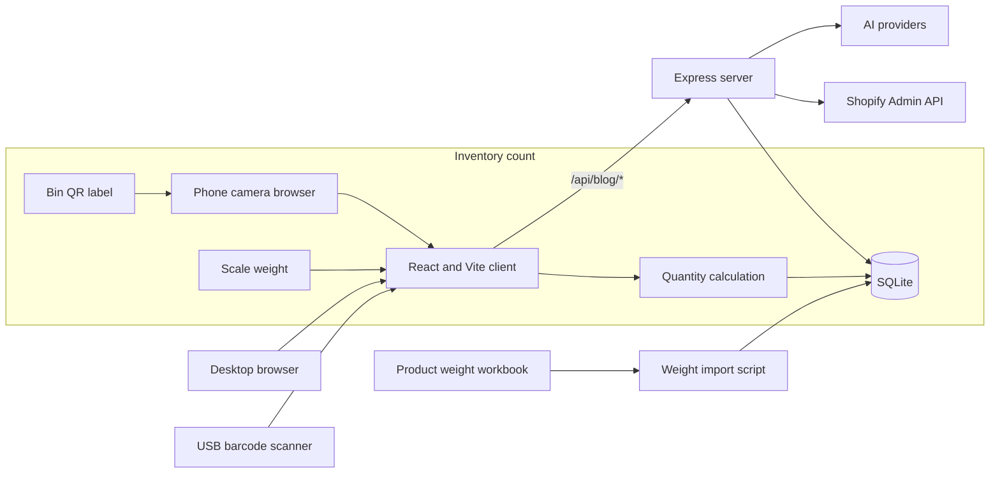

# iBoltMark Architecture

Last updated: 2026-08-25

## Purpose

iBoltMark is one application with two workspaces:

- **Content Studio** manages products, keywords, assets, blog generation, publishing, and visibility work.
- **Inventory Operations** imports product weights, creates physical bin labels, scans QR codes and barcodes, calculates quantities from scale weights, and records count history.

The workspaces intentionally share company, authentication, product, integration, and SQLite data. Inventory operations should remain visually and operationally separate from content creation while reusing the same product catalog.

## System Map



## Runtime Layout

| Layer | Responsibility | Main files |
| --- | --- | --- |
| Client routing | Application routes and workspace entry points | `client/src/App.tsx` |
| Workspace shell | Content and inventory navigation separation | `client/src/components/BlogShell.tsx` |
| Inventory UI | Bin creation, camera scan, lookup, calculation, count history | `client/src/pages/InventoryCount.tsx` |
| Inventory client API | Typed inventory queries and mutations | `client/src/hooks/useInventory.ts` |
| Product UI | Product catalog and Shopify inventory sync control | `client/src/pages/ProductCatalog.tsx` |
| Product client API | Product queries and read-only sync mutation | `client/src/hooks/useProducts.ts` |
| HTTP server | Express startup, middleware, and route registration | `server/index.ts`, `server/routes.ts` |
| Inventory API | Inventory endpoints and request validation | `server/inventoryRoutes.ts` |
| Inventory domain | QR generation, lookup, weight math, and count persistence | `server/inventoryManager.ts` |
| Product API | Imports, catalog access, and Shopify inventory reads | `server/productRoutes.ts`, `server/productScraper.ts` |
| Workbook importer | Spreadsheet parsing, normalization, and product upserts | `server/productImporter.ts`, `scripts/import-product-weights.ts` |
| Persistence | Drizzle schema and startup-safe SQLite creation | `shared/schema.ts`, `server/db.ts` |

## Company And Access Boundary

Company-scoped records use a `companyId`. Local development falls back to `ibolt-default-company` when no selected company is supplied. The primary boundary tables are:

- `companies`
- `company_memberships`
- `brand_profiles`
- `company_integrations`

Routes that accept company context must resolve it from authenticated access or the established local development fallback. A client-provided company ID must not become an authorization mechanism by itself.

The current app still contains local-development assumptions. Before deployment to multiple users, enforce membership checks on every company-scoped route and define administrator, counter, reviewer, and publisher roles.

## Data Model

The default local database is:

```text
data/standalone-blog-writer.db
```

The main product and inventory records are:

| Drizzle symbol | SQLite table | Purpose |
| --- | --- | --- |
| `products` | `ibolt_products` | Shared product catalog, SKU, barcode, Shopify IDs, source metadata, and unit weight |
| `inventoryBins` | `inventory_bins` | Physical bin identity, QR code, product assignment, location, tare, and status |
| `inventoryCounts` | `inventory_counts` | Scale input, calculated quantity, rounding, counter, notes, and audit timestamp |

Content data includes brand profiles, products, verticals, keyword clusters, assets, blog posts, generated sections, citations, visibility records, and Shopify publishing state. See `shared/schema.ts` for the authoritative schema.

`server/db.ts` creates required local tables and indexes safely during startup. `npm run db:push` runs the same additive reconciliation and then verifies SQLite integrity, foreign keys, required tables, and the repaired OCR uniqueness index. This is a compatibility measure for the active local database, not a replacement for reviewed production migrations.

## Inventory Workflow

### 1. Import Product Weights

Run the importer against an `.xlsx` workbook:

```bash
npx tsx scripts/import-product-weights.ts "/absolute/path/Product Weights - Compact with Part Barcodes.xlsx"
```

Set `IMPORT_COMPANY_ID` when importing into a company other than the local default. The importer reads the product title, part number or SKU, category, weight, and barcode columns, normalizes weights to ounces, and upserts products with source metadata.

The workbook inspected on 2026-08-25 contained 144 data rows and produced 137 unique products. Its barcode cells were empty, so the importer used the part number as the scan value. That fallback should be replaced by real manufacturer or printed barcode values when available.

### 2. Create A Physical Bin

A product row is not yet a countable bin. An operator creates an inventory bin with:

- Product
- Human-readable bin label
- Unique QR code
- Location
- Unit weight in ounces
- Empty-bin tare in ounces
- Optional notes

The server generates a QR label. Its payload is based on the browser origin:

```text
{current-origin}/blog/inventory?bin={qr-code}
```

Generate production labels from the HTTPS deployment or private tunnel origin. A label generated from `localhost` will only work on the computer that created it.

### 3. Scan And Lookup

The camera scanner uses ZXing and supports QR codes plus common one-dimensional product barcodes. The same input also accepts a USB scanner, pasted URL, QR code, bin ID, SKU, or product barcode.

Lookup resolves a physical bin first. Product SKU or barcode matches can prefill product data, but the operator must create or select a bin before saving a physical count.

### 4. Calculate And Save

All weights are converted to ounces before calculation:

```text
quantity = (totalBinWeightOz - emptyBinTareOz) / unitWeightOz
```

The operator chooses floor, nearest, or ceiling rounding. The server repeats the calculation and stores the raw inputs, calculated quantity, rounding mode, counter, notes, and timestamp. Client-side math is only a preview; the server result is authoritative.

## Product And Shopify Integration

Products can originate from the weight workbook, manual entry, public Shopify catalog data, Shopify Admin API data, PDFs, or other existing content workflows. Source type and source metadata should remain attached to imported records so conflicts can be audited.

The inventory sync endpoint is:

```text
POST /api/blog/products/sync-shopify-inventory
```

It reads Shopify products, variants, and available inventory into the local catalog. It does not update Shopify. The Admin API token needs at least:

```text
read_products, read_inventory
```

As of 2026-08-25, the local Shopify custom app has approved `read_products` and `read_inventory`. A read-only sync completed with 473 products, 625 inventory items, and 639 inventory levels. The sync used only Shopify Admin API GET requests and local database upserts.

The content publishing subsystem can create Shopify articles. That is a separate, already explicit publishing action. Inventory writeback must remain disabled. If Shopify quantity updates are added later, use a separate route and permission with preview, location mapping, idempotency keys, audit logs, variance thresholds, and a human confirmation step.

## Inventory API

All routes are mounted under `/api/blog/inventory`.

| Method | Path | Purpose |
| --- | --- | --- |
| `GET` | `/bins` | List active or matching bins |
| `POST` | `/bins` | Create a bin and QR label |
| `GET` | `/bins/:id` | Read one bin |
| `PATCH` | `/bins/:id` | Update bin metadata |
| `DELETE` | `/bins/:id` | Deactivate or remove a bin |
| `POST` | `/lookup` | Resolve a QR payload, code, SKU, or barcode |
| `POST` | `/calculate` | Calculate a quantity and optionally save it |
| `GET` | `/counts` | Read recent count history |

Request and response types are defined near their schema records in `shared/schema.ts` and used by the client hooks.

## Local And Phone Access

Install and start the application:

```bash
npm install
npm run dev
```

The default page is:

```text
http://localhost:5001/blog/inventory
```

The server listens on `0.0.0.0`, but phone camera access should use HTTPS. For tailnet-only testing with Tailscale Serve:

```bash
tailscale serve --bg --yes 5001
tailscale serve status
```

Open the HTTPS URL shown by `tailscale serve status` on a phone signed into the same tailnet. To disable the proxy:

```bash
tailscale serve --https=443 off
```

Tailscale Serve is private network access, not a production hosting or backup strategy.

## Configuration

Configuration is documented in `.env.example`. Important inventory and integration variables include:

| Variable | Purpose |
| --- | --- |
| `PORT` | Express and Vite development port; default `5001` |
| `DATABASE_PATH` | SQLite file path |
| `IMPORT_COMPANY_ID` | Company receiving workbook imports |
| `SHOPIFY_STORE_DOMAIN` | Shopify store host |
| `SHOPIFY_ACCESS_TOKEN` | Admin API token; never commit it |
| `SHOPIFY_API_VERSION` | Admin API version used by server integrations |

AI, authentication, encryption, and publishing variables remain documented in `.env.example`. Real `.env` files and credentials must stay outside Git.

## Verification

Run the static and production build checks before a release:

```bash
npm run check
npm run build
```

The inventory smoke test should verify:

1. Import a known workbook row and confirm SKU, category, barcode, and unit weight.
2. Create a temporary bin and render its QR label.
3. Scan the label from a phone over HTTPS and confirm the correct bin loads.
4. Scan or type a product barcode and confirm the matching product is offered.
5. Calculate a known scale example and compare the server result manually.
6. Save a count and confirm it appears in recent history with an audit timestamp.

Remove temporary test rows after a clean smoke test unless they are intentionally retained as training records.

## Persistence And Recovery

Git preserves source code and documentation. It does not preserve:

- The SQLite database
- Imported product rows
- Inventory bins or count history
- Source workbooks
- `.env` credentials
- Generated QR PNG files
- Tailscale login or Serve state

For an operational system, back up the SQLite file while writes are paused or use SQLite's online backup mechanism. Store encrypted backups outside the application machine and test restoration. Keep the source workbook in controlled business storage with version history.

A basic recovery sequence is:

1. Restore the reviewed code revision and install dependencies.
2. Restore `.env` from the secret manager.
3. Restore the SQLite backup or apply migrations to a clean database.
4. Reconnect Shopify with approved read scopes.
5. Re-enable the HTTPS deployment or private access proxy.
6. Scan a known bin and run a no-save calculation before allowing counts.

## Known Issues

- Raw `drizzle-kit push` on the legacy SQLite schema emits duplicate unique-index statements while rebuilding tables. Use the safe `npm run db:push` reconciler locally. Keep `npm run db:push:drizzle` for disposable database analysis until the upstream SQLite push issue is resolved and a generated migration plan is reviewed.
- The inspected workbook had no populated barcode column. Part-number fallback works for testing but may not match printed labels.
- Test bins and imported spreadsheet rows live only in the local database unless included in a database backup.
- Tailscale access depends on this machine remaining online and connected.
- Shopify read access depends on the legacy custom app retaining `read_products` and `read_inventory`; verify granted scopes after app reinstall, token rotation, or scope changes.
- Browser camera scanning requires a secure HTTPS origin outside localhost.

## Operational Rollout

1. Reconcile the database migration/index mismatch and define a repeatable migration process.
2. Choose an always-on host, encrypted backup destination, retention policy, and restore drill.
3. Monitor Shopify token health and verify `read_products` and `read_inventory` after app reinstall, rotation, or scope changes.
4. Define physical naming, location, tare measurement, label replacement, and damaged-bin procedures.
5. Validate unit weights and barcode conflicts against physical samples.
6. Pilot 10 to 20 bins, compare counts with Shopify, and record variance causes without writing back.
7. Add variance reporting, count-session export, user roles, device procedures, and recovery ownership.
8. Design Shopify writeback as a separately approved phase after the read-only pilot is stable.

## Architecture Decisions

- Keep Content Studio and Inventory Operations in one application but expose them as distinct workspaces.
- Keep one company-scoped product catalog so content and inventory metadata do not drift into parallel copies.
- Treat a product and a physical bin as different records; scanning a valid SKU does not imply a bin exists.
- Store canonical weights in ounces and repeat quantity calculations on the server.
- Generate QR URLs from the active browser origin so labels target the intended environment.
- Keep Shopify inventory synchronization read-only until a separate writeback design is reviewed and explicitly authorized.
- Treat the local startup schema workaround as temporary; production requires reviewed migrations and backups.
