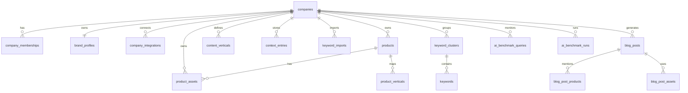
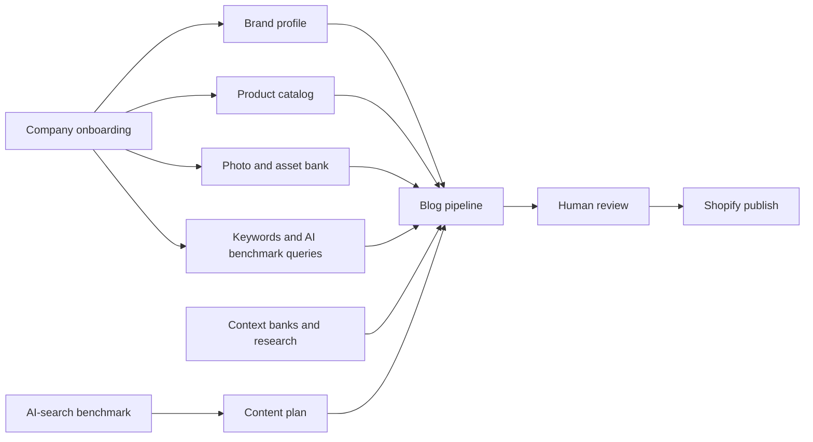

# Standalone Blog Writer Architecture

Last reviewed: 2026-05-25

This repo is still the ScholarMark/iBolt fork, but the blog system is now a real working subsystem rather than a blank plan. The next architecture step is not "build the blog writer from scratch." It is to extract the iBolt-specific implementation into a company-configurable product that other brands can onboard into.

## Executive Summary

The current app can ingest keywords, maintain industry context, scrape the iBolt Shopify catalog, import catalog PDFs, store and analyze product photos, generate blog posts through a 4-phase AI pipeline, render Shopify-ready HTML, publish to Shopify, run scheduled jobs, and track AI-search visibility.

The main blocker to making this a standalone feature is that the implementation is still iBolt-shaped at the data, prompt, route, UI, and integration layers. There is no tenant or company boundary, no reusable brand profile model, no general Shopify OAuth/install flow, no cross-company product source abstraction, and no guided onboarding flow.

The recommended direction is to productize the existing blog subsystem in place first, then fork or rename the repo once the company abstraction is stable.

## Product Target

The standalone feature should be a multi-company content intelligence and blog generation product for ecommerce brands.

Core user flow:

1. Create a company workspace.
2. Connect product data from Shopify, CSV, PDF catalog, manual entry, or public product URLs.
3. Upload product and brand photos in bulk.
4. Annotate photos and products with use cases, verticals, claims, specs, and restrictions.
5. Enter brand guidelines, forbidden phrases, positioning, competitors, CTAs, and tone examples.
6. Import keyword data or create AI-search benchmark queries.
7. Generate, review, edit, and approve posts.
8. Publish drafts to Shopify.
9. Track how the brand appears in AI-search answers over time and feed those gaps back into content planning.

## Current Codebase Status

### Already Implemented

Backend modules are registered under `/api/blog` from `server/routes.ts`.

| Area | Status | Main files |
| --- | --- | --- |
| Blog pipeline | Real 4-phase pipeline: planner, section writer, stitcher, verifier | `server/blogPipeline.ts`, `server/brandVoice.ts` |
| HTML output | Shopify-ready HTML, FAQ schema, product auto-links, previews | `server/htmlRenderer.ts` |
| Keywords | CSV import, scoring, clustering, vertical mapping | `server/keywordManager.ts`, `server/keywordRoutes.ts` |
| Context banks | Verticals, entries, seeds, research ingestion | `server/contextBanks.ts`, `server/contextRoutes.ts`, `server/contextSeeds.ts` |
| Product catalog | Shopify product scrape, product CRUD, vertical mapping | `server/productScraper.ts`, `server/productRoutes.ts` |
| Catalog PDFs | PDF import, AI extraction, product matching | `server/catalogImporter.ts`, `server/catalogRoutes.ts` |
| Photo bank | Upload, directory import, thumbnails, vision analysis, auto-association | `server/photoBank.ts`, `server/photoRoutes.ts`, `server/photoSelector.ts` |
| Shopify publishing | Article create/update/list/delete and collection updates | `server/shopifyPublisher.ts`, `server/shopifyRoutes.ts` |
| AI benchmark | Provider runs, query/result tables, content-plan generation | `server/aiBenchmark.ts`, `server/benchmarkRoutes.ts` |
| Scheduling | Research, product sync, auto-generation, photo analysis, benchmark runs | `server/scheduler.ts`, `server/schedulerRoutes.ts` |
| Competitor scraping | Blog/sitemap analysis for content ideas | `server/competitorScraper.ts` |

Frontend blog routes are also real pages, not placeholders.

| Route | Page | Current use |
| --- | --- | --- |
| `/blog` | `client/src/pages/BlogDashboard.tsx` | Stats, recent posts, quick actions |
| `/blog/keywords` | `client/src/pages/KeywordManager.tsx` | CSV import, keyword tables, clustering |
| `/blog/generate` | `client/src/pages/BatchGenerator.tsx` | Queue, SSE generation, competitor URLs |
| `/blog/posts/:id` | `client/src/pages/PostReview.tsx` | Markdown editor, scores, preview, Shopify publish |
| `/blog/context` | `client/src/pages/IndustryContext.tsx` | Verticals, context entries, research triggers |
| `/blog/products` | `client/src/pages/ProductCatalog.tsx` | Product grid, scrape, mapping, manual add |
| `/blog/catalog` | `client/src/pages/CatalogImport.tsx` | Catalog PDF import and extraction review |
| `/blog/photos` | `client/src/pages/PhotoBank.tsx` | Photo upload, analysis, association, delete |
| `/blog/benchmark` | `client/src/pages/AiBenchmark.tsx` | AI-search benchmark runs and content plans |

### Database Tables Already Present

Core blog tables exist in `shared/schema.ts` and are also created in `server/db.ts`.

| Table group | Tables |
| --- | --- |
| Context | `industry_verticals`, `context_entries`, `pipeline_context_chunks` |
| Keywords | `keyword_imports`, `keyword_clusters`, `keywords` |
| Products | `ibolt_products`, `product_verticals`, `product_feed_audits` |
| Blog generation | `generation_batches`, `blog_posts`, `blog_post_products` |
| Research | `research_jobs` |
| Catalog | `product_catalog_imports`, `product_catalog_extractions` |
| Photos | `product_photos`, `blog_post_photos` |
| AI benchmark | `ai_benchmark_queries`, `ai_benchmark_runs`, `ai_benchmark_results` |

ScholarMark tables still exist and are outside the standalone blog product path unless we intentionally reuse document upload, OCR, annotation, or project features.

## Current Blocking Gaps

### 1. No Company Or Tenant Model

There is no `companies`, `workspaces`, `brands`, `company_id`, or equivalent tenant boundary. Most blog tables are global. This prevents multiple brands from using the system safely.

Needed:

- `companies`
- `company_memberships`
- `brand_profiles`
- `company_integrations`
- `company_settings`
- `company_usage_events`
- `company_id` on blog, product, keyword, context, photo, catalog, benchmark, scheduler, and integration tables

### 2. iBolt-Specific Hardcoding

The system is hard-coded to iBolt in prompts, URLs, product scraping, Shopify publishing, benchmark scoring, seeds, UI copy, and defaults.

Examples:

- `server/brandVoice.ts` contains the iBolt voice as a constant.
- `server/productScraper.ts` scrapes `https://iboltmounts.com/products.json`.
- `server/htmlRenderer.ts` links products to `https://iboltmounts.com/products/...`.
- `server/shopifyPublisher.ts` defaults to `iboltmounts` and fixed blog IDs.
- `server/aiBenchmark.ts` has iBolt-specific fields and scoring such as `iboltAngle`, `brandMentioned`, and `iboltCited`.
- UI pages say "iBolt Blog Generator" and use iBolt-specific labels.

Needed:

- Move all brand facts into database-backed `brand_profiles`.
- Pass a `CompanyContext` through every pipeline, renderer, scraper, publisher, benchmark, and scheduler call.
- Keep iBolt as a seeded demo/customer workspace rather than the application identity.

### 3. No Guided Onboarding

The app has working operational screens, but no path for a new company to set itself up.

Needed onboarding steps:

1. Company basics: name, website, logo, primary market, ecommerce platform.
2. Brand voice: tone, banned phrases, CTA style, writing examples, claims rules.
3. Product source: Shopify OAuth, public Shopify JSON, CSV, manual products, catalog PDF.
4. Photo source: bulk upload, directory import, Shopify media sync, manual product mapping.
5. SEO source: keyword CSV, seed topics, competitors, AI-search benchmark prompts.
6. Publishing target: Shopify store, blog target, default draft/live setting.
7. Review policy: required scores, human approval, auto-publish rules.

### 4. Photo Bank Is Useful But Not Productized

The photo bank already supports upload, thumbnails, analysis, auto-association, and deletion. It needs to become a first-class asset system for non-technical users.

Needed:

- Bulk upload with product picker and drag/drop.
- Manual annotation and edit modal for each photo.
- Product, use-case, vertical, angle, quality, rights, and hero flags.
- Import from Shopify product media.
- Photo selection preview in post review.
- Reusable asset library across posts.
- Company-level storage limits and cleanup tools.

### 5. Product Catalog Needs Source Abstraction

The product catalog currently assumes iBolt and Shopify-style product data.

Needed product source model:

- Shopify OAuth store sync.
- Public Shopify `/products.json` sync for unauthenticated catalogs.
- CSV import.
- Manual entry.
- PDF catalog extraction.
- Product URL scrape.
- Future: WooCommerce, BigCommerce, Webflow, custom API.

Product records need richer fields:

- SKU and variant data.
- Specs and dimensions.
- Claims and disclaimers.
- Compatibility.
- Inventory and availability.
- Product media.
- Source provenance.
- Last synced state.

### 6. Shopify Publishing Is Partly Duplicated

Two publish paths exist:

- Newer sync path in `server/shopifyRoutes.ts` and `server/shopifyPublisher.ts` persists article IDs and sync metadata.
- Older path in `server/blogRoutes.ts` marks status as published but does not persist the Shopify article ID.

Needed:

- Keep one publishing service.
- Route all UI and API publish actions through the sync path.
- Store per-company Shopify credentials and blog targets.
- Support OAuth/install rather than static env vars.
- Store publish events and external URLs.

### 7. AI Benchmark Is Valuable But iBolt-Specific

The benchmark system already tracks prompts, providers, results, brand mentions, citations, competitor mentions, and content gaps. This is exactly the "how do we appear in AI search over time" feature.

Needed:

- Rename iBolt-specific fields to generic fields.
- Track target brand, target domains, target products, known competitors, and desired positioning from `brand_profiles`.
- Store benchmark runs per company.
- Add trend charts, gap detection, and recommended content actions.
- Let benchmark gaps create keyword clusters or generation jobs.

Suggested generic schema renames:

| Current | Generic |
| --- | --- |
| `iboltAngle` | `brandAngle` |
| `iboltCited` | `targetDomainCited` |
| `brandMentioned` | `targetBrandMentioned` |
| `ibolt_products` | `products` |
| `iBolt Blog Generator` | company-configured product name or neutral app name |

### 8. UI Needs A Standalone App Shell

The blog pages work, but the app still inherits a ScholarMark/EVA shell and page-by-page navigation.

Needed:

- Blog-first app shell with persistent sidebar.
- Company switcher.
- Setup checklist.
- Settings section.
- Connections section.
- Asset, product, content, benchmark, and publish navigation.
- Dashboard links for existing catalog and photo pages.
- Remove or hide ScholarMark routes for standalone deployments.
- Replace internal/admin styling with a calmer SaaS workflow UI.

### 9. Security And Multi-User Readiness

Blog routes are currently easy to access in local/dev mode, and the frontend blog routes are not wrapped with `ProtectedRoute`.

Needed:

- Protect blog routes consistently in frontend and backend.
- Add roles: owner, admin, editor, reviewer, viewer.
- Scope all queries by company.
- Encrypt integration tokens.
- Add audit logs for publish, delete, benchmark, and scheduler actions.

### 10. Ruflo Is Not Integrated

The scheduler and research agent are Ruflo-inspired, but there is no actual Ruflo integration in this repo.

Needed:

- Decide whether Ruflo is required or whether the current scheduler is enough.
- If required, integrate Ruflo behind the scheduler/orchestration boundary.
- Keep blog generation independent of a specific agent framework so jobs can run locally, through Ruflo, or through another queue later.

## Proposed Standalone Architecture

### Core Domain Model



### Runtime Flow



### CompanyContext Contract

Every backend service that currently assumes iBolt should accept a `CompanyContext`.

```ts
interface CompanyContext {
  company: {
    id: string;
    name: string;
    websiteUrl: string;
    primaryDomain: string;
  };
  brandProfile: {
    displayName: string;
    positioning: string;
    toneTraits: string[];
    bannedPhrases: string[];
    preferredCtas: string[];
    requiredClaims: string[];
    forbiddenClaims: string[];
    writingSamples: string[];
  };
  integrations: {
    shopify?: {
      shop: string;
      accessTokenRef: string;
      defaultBlogId?: number;
    };
  };
  competitors: Array<{
    name: string;
    domains: string[];
  }>;
}
```

### Generalized Services

| Current service | Standalone target |
| --- | --- |
| `brandVoice.ts` | `brandProfiles.ts` plus prompt builders that consume `CompanyContext` |
| `productScraper.ts` | `catalogSources/shopifyPublic.ts`, `catalogSources/shopifyAdmin.ts`, `catalogSources/csv.ts` |
| `shopifyPublisher.ts` | `publishing/shopifyPublisher.ts` using company integration credentials |
| `htmlRenderer.ts` | `renderers/shopifyRenderer.ts` with company domain/product URL config |
| `iboltResearchAgent.ts` | `researchAgent.ts` with company verticals and competitors |
| `aiBenchmark.ts` | `visibilityBenchmark.ts` with generic target brand/domain scoring |
| `contextSeeds.ts` | demo seed packs plus user-generated verticals |
| `scheduler.ts` | company-scoped job scheduler and job history |

## Standalone Feature Areas

### 1. Setup And Onboarding

Build a `/setup` or `/blog/setup` flow. This should be the first screen for a new company.

Minimum MVP:

- Company profile form.
- Brand voice form.
- Shopify connection or public product URL.
- Keyword CSV import.
- Photo upload.
- Generate first 3 topic ideas.

### 2. Brand Theme And Guidelines

The "theme" should mean more than colors. It should be the company writing and publishing profile.

Fields:

- Brand name and short description.
- Website and product URL pattern.
- Audience/personas.
- Positioning and differentiators.
- Tone traits.
- Banned phrases.
- Required terms.
- Claims requiring verification.
- Competitors.
- CTA style.
- Example posts or writing samples.
- Shopify HTML style preferences.

### 3. Product Catalog

For a standalone system, product catalog ingestion is a feature, not a script.

MVP sources:

- Shopify Admin OAuth.
- Public Shopify product JSON.
- CSV upload.
- Manual products.
- PDF catalog extraction.

Future sources:

- WooCommerce.
- BigCommerce.
- Product feed XML.
- Google Merchant Center.
- Custom API.

### 4. Photo And Asset Bank

This is the area the user guessed correctly: a reusable image bank is required.

MVP:

- Bulk import.
- Thumbnail gallery.
- AI analysis.
- Manual annotation.
- Product association.
- Use-case and vertical tagging.
- Rights/status fields.
- Hero and inline image flags.

Post generation should consume this bank and show selected images during review.

### 5. Content Generation

The 4-phase pipeline remains the right core.

Generalized inputs:

- Keyword cluster or AI benchmark gap.
- Company brand profile.
- Product catalog.
- Product assets.
- Context bank.
- Competitor context.
- Publishing target.

Quality gate:

- Brand consistency.
- SEO optimization.
- Natural language.
- Factual accuracy.
- Product accuracy.
- Claims compliance.
- Publishing readiness.

### 6. Shopify Publishing

MVP:

- OAuth install.
- Select target blog.
- Publish as draft by default.
- Store external article ID.
- Update existing article rather than duplicate.
- Show sync state in post review and dashboard.

Later:

- Collections and pages.
- Theme-aware article templates.
- Product media publishing.
- Bulk publish queue.

### 7. AI Search Visibility Benchmark

This should become a core differentiator.

MVP:

- Query library per company.
- Providers: ChatGPT, Claude, Gemini, Gemini with search where configured.
- Run history.
- Mention/citation/rank/sentiment/competitor extraction.
- Gap list.
- "Generate content for this gap" action.

Metrics:

- Target brand mention rate.
- Target domain citation rate.
- Top-3 recommendation rate.
- Average coverage score.
- Competitor share of answer.
- Query-level trend over time.

### 8. Orchestration

The current scheduler is enough for the first standalone version if it becomes company-scoped.

Jobs:

- Product sync.
- Photo analysis.
- Research.
- Context chunk rebuild.
- AI benchmark.
- Blog generation.
- Shopify publish.

Ruflo can be integrated later behind this job boundary if the current scheduler becomes too limited.

## Implementation Plan

### Phase A: Productization Foundation

Goal: Make iBolt one company record instead of the whole app.

Tasks:

- Add `companies`, `company_memberships`, `brand_profiles`, `company_integrations`.
- Add `company_id` to all blog-related tables.
- Create an iBolt seed company and migrate current global data into it.
- Add a `CompanyContext` loader.
- Scope blog APIs by active company.
- Protect frontend blog routes.

### Phase B: Generalize iBolt Services

Goal: Remove hard-coded iBolt assumptions from runtime logic.

Tasks:

- Replace `BRAND_VOICE` constant usage with company `brandProfile`.
- Generalize product URLs and product linking.
- Generalize Shopify shop/blog IDs into `company_integrations`.
- Rename or alias iBolt-specific benchmark fields.
- Convert iBolt vertical seeds into a demo seed pack.
- Keep existing iBolt behavior as the first configured workspace.

### Phase C: Standalone Onboarding UI

Goal: Let another company set itself up without touching code.

Tasks:

- Add setup wizard.
- Add company settings pages.
- Add brand profile editor.
- Add integrations page.
- Add dashboard setup checklist.
- Build a persistent blog app shell with navigation.

### Phase D: Asset And Catalog Workflow

Goal: Make product data and photos editable, reviewable, and reusable.

Tasks:

- Add product source abstraction.
- Add Shopify OAuth/public Shopify import option.
- Add CSV product import.
- Improve catalog extraction review actions.
- Add photo detail/edit modal.
- Add manual product/photo association.
- Add post image selection preview.

### Phase E: Visibility Benchmark Product

Goal: Turn AI benchmark into a repeatable company feature.

Tasks:

- Generalize target brand/domain scoring.
- Add historical trend UI.
- Add competitor answer share.
- Add content gap queue.
- Let users materialize a benchmark gap into a keyword cluster or blog draft.

### Phase F: Publishing And Review Polish

Goal: Make publish safe and predictable.

Tasks:

- Consolidate duplicate Shopify publish routes.
- Add publish history.
- Add approval workflow.
- Add bulk publish UI.
- Add sync error handling and retry.
- Add generated HTML visual QA.

### Phase G: Fork/Rename

Goal: Split into a clean standalone repo only after product boundaries are stable.

Tasks:

- Rename package and app.
- Hide or remove ScholarMark routes.
- Move legacy ScholarMark code behind feature flags or delete it.
- Add `.env.example`.
- Add setup docs.
- Add deployment docs.

## Immediate Next Tasks

The best next work is narrow and high leverage:

1. Add a `companies` and `brand_profiles` schema, seed iBolt into it, and add a `CompanyContext` loader.
2. Convert `server/brandVoice.ts` prompt builders to accept a brand profile while keeping iBolt as the default.
3. Wrap frontend blog routes in `ProtectedRoute` and add a blog app shell/sidebar.
4. Add dashboard links to existing `/blog/catalog` and `/blog/photos` pages.
5. Consolidate Shopify publishing onto the newer sync route.
6. Rename/genericize AI benchmark concepts in the UI and schema adapter layer.
7. Add a setup checklist page that collects company, brand, catalog, photos, keywords, and Shopify status.

## Verification Notes

Subagent backend review reported `npm run check` passing on 2026-05-25. This architecture update itself is documentation-only and does not change runtime behavior.

