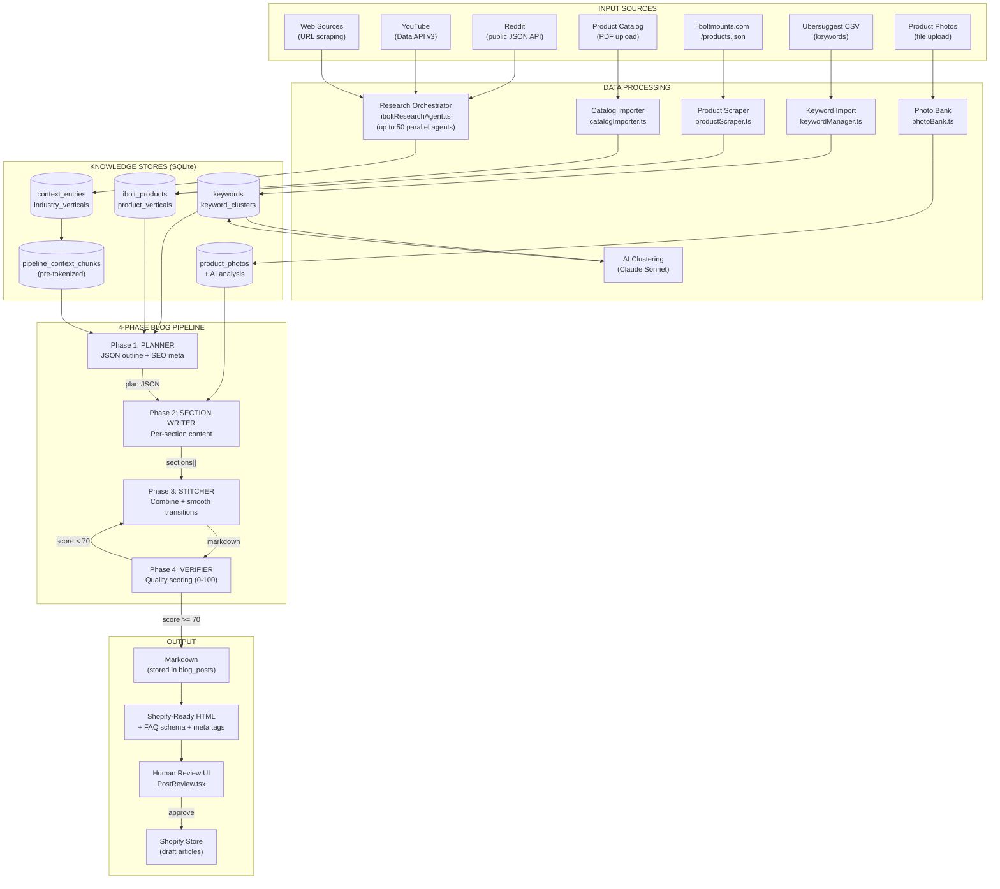
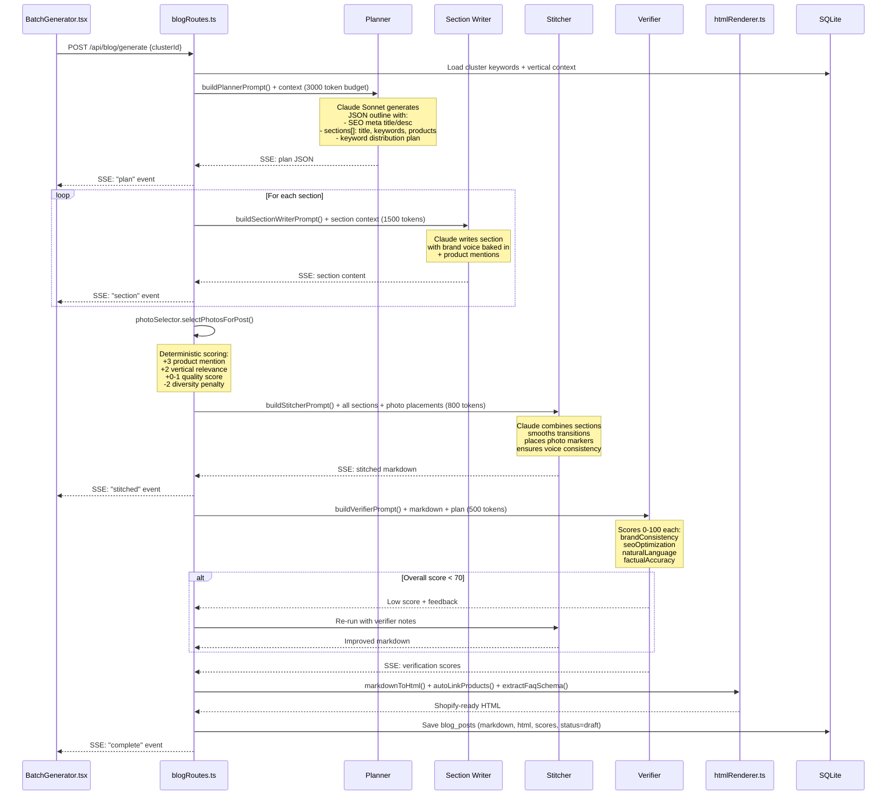
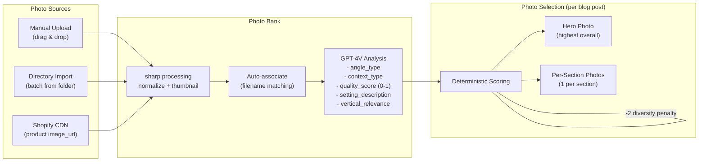
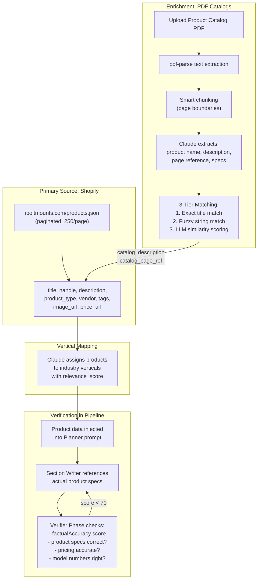
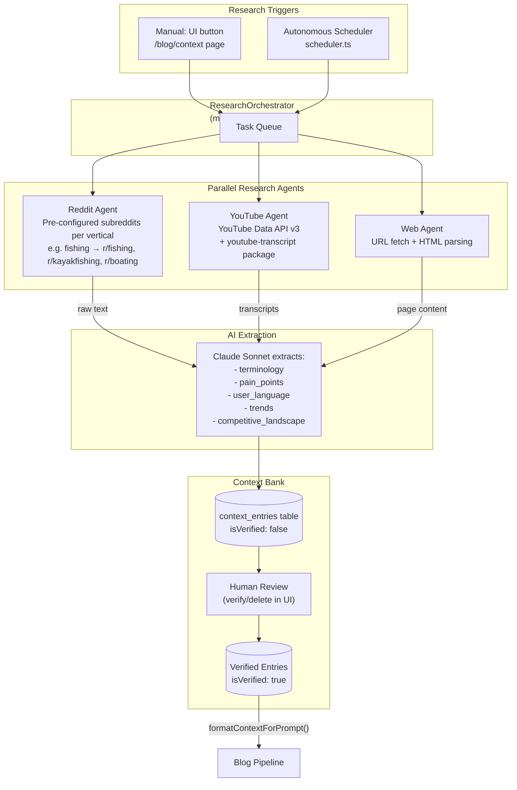
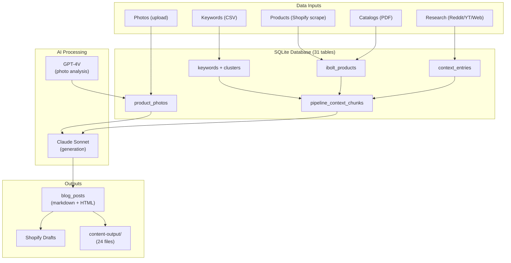

# iBolt Blog Generator — System Diagrams

Visual reference for how the writing system works end-to-end: keyword ingestion, context banking, photo selection, blog generation, and publishing.

---

## 1. Full System Overview

---

## 2. Blog Pipeline Detail (4 Phases)

---

## 3. How Photos Are Found and Selected

---

## 4. How Product Info Is Verified and Enriched

---

## 5. Research Agent Architecture

---

## 6. Keyword → Blog Post Flow

```mermaid
graph LR
    CSV["Ubersuggest CSV"] --> IMPORT["Import + Deduplicate<br/>keywordManager.ts"]
    IMPORT --> SCORE["Opportunity Score<br/>volume(0.4) + difficulty(0.3)<br/>+ position(0.3)"]
    SCORE --> CLUSTER["AI Clustering<br/>(Claude, batch 10)"]
    CLUSTER --> MAP["Auto-Map to Vertical<br/>verticalCreator.ts"]

    MAP --> SELECT["User selects clusters<br/>in BatchGenerator.tsx"]
    SELECT --> GENERATE["Blog Pipeline<br/>(4 phases)"]
    GENERATE --> DRAFT["Draft Post<br/>(status: draft)"]
    DRAFT --> REVIEW["Human Review<br/>PostReview.tsx"]
    REVIEW -->|"approve"| PUBLISH["Status: approved<br/>Ready for Shopify"]

    style CSV fill:#e1f5fe
    style PUBLISH fill:#c8e6c9
```

---

## 7. Data Flow Summary

